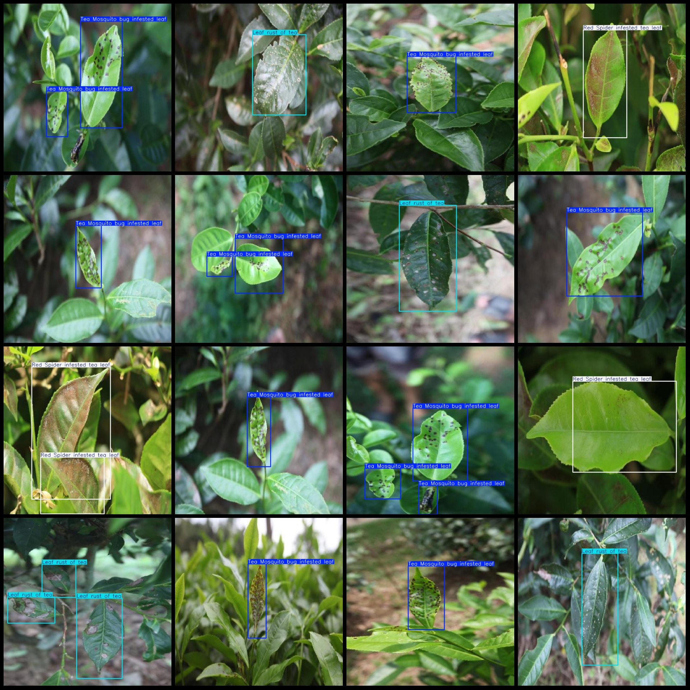
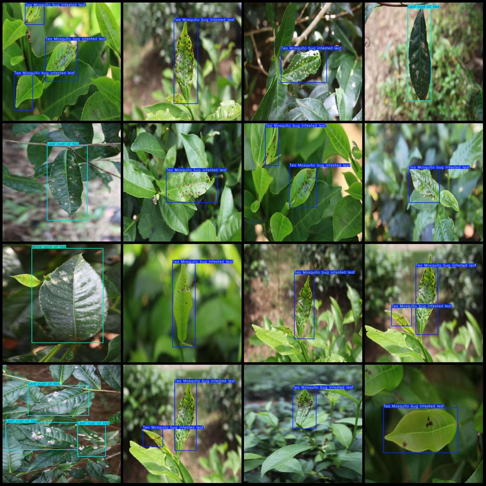

# Tea Leaf Disease Detection Dataset in VOC+YOLO Format with 2715 Images and 8 Categories

Dataset format: Pascal VOC format + YOLO format (without split path in txt files, only containing jpg images and corresponding VOC format xml files and YOLO format txt files)

Number of images (jpg file counts): 2715
Number of annotations (xml file counts): 2715
Number of annotations (txt file counts): 2715
Number of annotator categories: 8
Annotator category names: ["Black rot of tea", "Brown blight of tea", "Leaf rust of tea", "Red Spider infested tea leaf", "Tea Mosquito bug infested leaf", "Tea leaf", "White spot of tea", "disease"]

Each category annotation boxes count:
- Black rot of tea boxes count = 40
- Brown blight of tea boxes count = 2
- Leaf rust of tea boxes count = 966
- Red Spider infested tea leaf boxes count = 329
- Tea Mosquito bug infested leaf boxes count = 2091
- Tea leaf boxes count = 136
- White spot of tea boxes count = 96
- Disease boxes count = 1
Total boxes count: 3661

Each category occupied images count:
- Tea Black Rot occupied images count = 31
- Brown Blight of Tea occupied images count = 2
- Leaf Rust of Tea occupied images count = 662
- Red Spider Infested Tea Leaf occupied images count = 195
- Tea Mosquito Bug Infested Leaf occupied images count = 1593
- Tea Leaf (Healthy Tea Leaves) occupied images count = 136
- White Spot of Tea (Tea Lesion Disease) occupied images count = 96
- Disease (Unclassified Diseases) occupied images count = 1
Image resolution: 640x640
Annotation tool used: labelImg
Annotation rules: draw bounding box for each category
Important note: The dataset does not have separate training, validation, or test sets; you will need to manually divide them.
Special declaration: This dataset does not guarantee any precision improvement on models trained with this data or weight files.
Image preview:
## Images

Here is a pay link on Stripe ( https://buy.stripe.com/3cs8yP7sY87d0vu9AB ). Please contact me lonlonago@foxmail.com after funding $89, and I will send you a complete data files , thank you!

